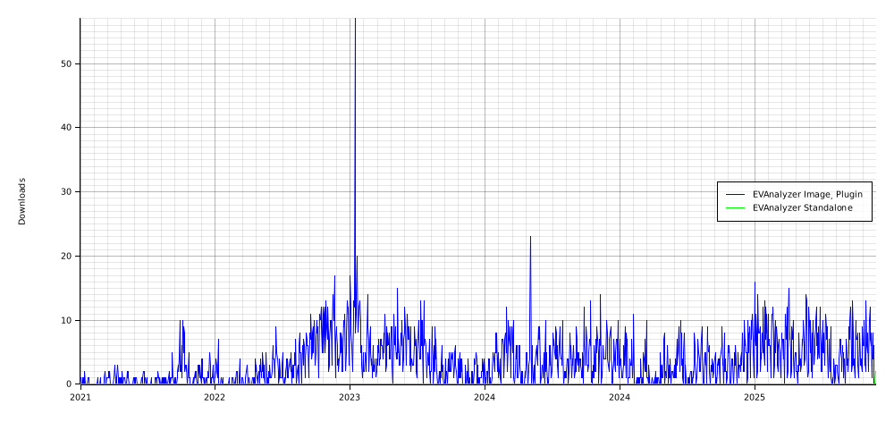
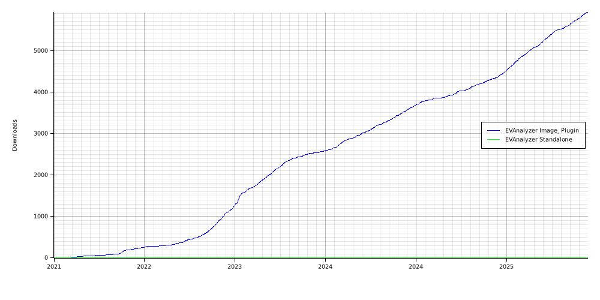

# EVAnalyzer Download Statistics

Tracks daily downloads of [EVAnalyzer](https://github.com/evanalyzer/evanalyzer) across two distribution channels:

- **ImageJ Plugin** — via the [ImageJ update site](https://sites.imagej.net/)
- **Standalone App** — via [GitHub Releases](https://github.com/evanalyzer/evanalyzer/releases)

Statistics are collected automatically every day at 23:00 UTC.

## Downloads per Day

## Accumulated Downloads

